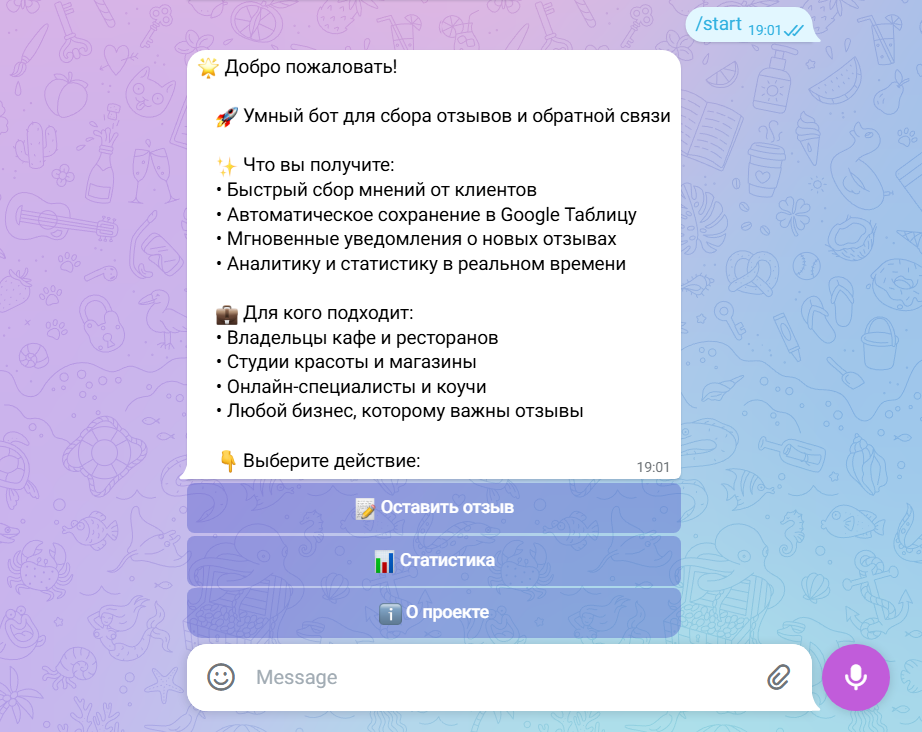
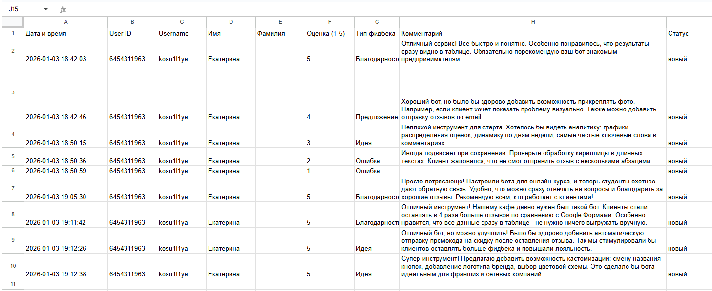
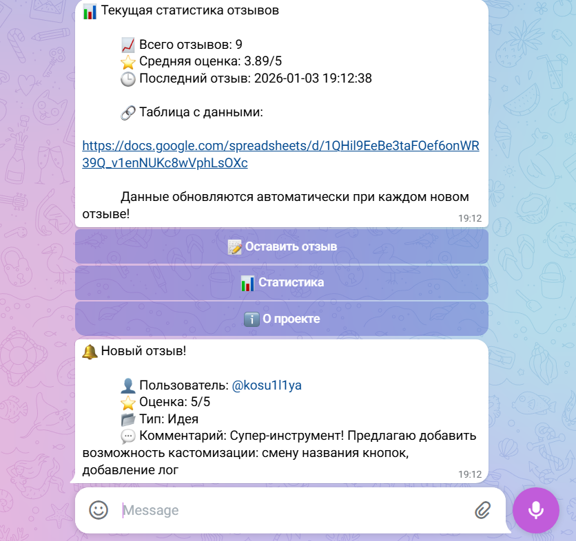
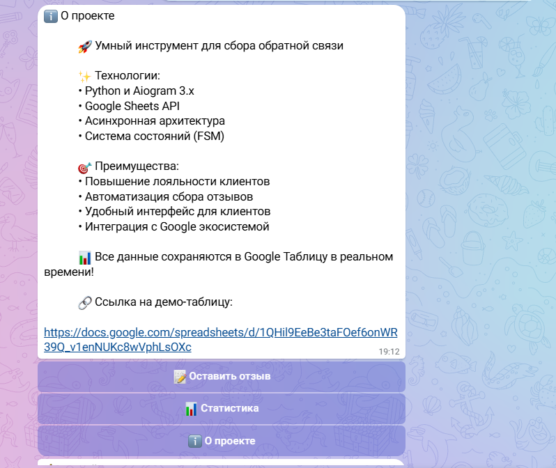

# 🤖 Feedback Bot

**Telegram-бот для автоматического сбора отзывов в Google Таблицу**

## ✨ Возможности

### 📊 Автоматический сбор отзывов
- Клиенты оценивают сервис по шкале 1-5
- Выбирают тип обратной связи
- Пишут комментарии
- Все данные сохраняются в реальном времени

### 📈 Мгновенная аналитика
- Статистика по отзывам прямо в боте
- Автоматическое обновление данных
- Средний рейтинг и общее количество отзывов

### 🔔 Уведомления для владельца
- Моментальные оповещения о новых отзывах
- Вся информация в одном сообщении
- Быстрый доступ к фидбеку клиентов

### 🗂️ Организация данных
- Все отзывы в одной Google Таблице
- Автоматическое форматирование
- Удобный просмотр и фильтрация

## 📸 Скриншоты

| Интерфейс бота | Google Таблица |
|----------------|----------------|
|  |  |
| **Статистика** | **О проекте** |
|  |  |

## 🛠 Технологии

- **Python 3.11+** — основной язык разработки
- **Aiogram 3.x** — асинхронный фреймворк для Telegram
- **Google Sheets API** — интеграция с таблицами
- **FSM (Finite State Machine)** — управление диалогами
- **Inline-клавиатуры** — удобный интерфейс

## 🚀 Быстрый старт

### 1. Клонирование репозитория
```
git clone https://github.com/ваш-юзернейм/feedback-bot.git
cd feedback-bot
```

### 2. Установка зависимостей
```
pip install -r requirements.txt
```

### 3. Настройка окружения
1. Скопируйте `.env.example` в `.env`
2. Получите токен бота у [@BotFather](https://t.me/BotFather)
3. Настройте Google Sheets API (инструкция ниже)
4. Заполните `.env` файл

### 4. Запуск бота
```
python main.py
```

## 🔧 Настройка Google Sheets API

### 1. Создайте проект в [Google Cloud Console](https://console.cloud.google.com)
### 2. Включите Google Sheets API
### 3. Создайте сервисный аккаунт
### 4. Скачайте `credentials.json`
### 5. Дайте доступ к таблице
### 6. Укажите ID таблицы в `.env`

## 📁 Структура проекта

```
feedback_bot/
├── main.py              # Основная логика бота
├── config.py            # Конфигурация приложения
├── keyboards.py         # Inline-клавиатуры
├── google_sheets.py     # Работа с Google Sheets API
├── requirements.txt     # Зависимости Python
└── screenshots/         # Скриншоты для документации
```

## 📋 Конфигурация (.env)

```
BOT_TOKEN=ваш_токен_бота
ADMIN_ID=ваш_telegram_id
SPREADSHEET_ID=id_вашей_google_таблицы
SHEET_NAME=Feedback
MAX_FEEDBACK_LENGTH=5000
```

## 💼 Для бизнеса

### 🏪 Кафе и рестораны
Собирайте отзывы о качестве еды и обслуживании сразу после визита клиента.

### 🛍️ Магазины
Получайте фидбек о товарах и доставке в удобном формате.

### 💅 Студии красоты
Узнавайте мнения клиентов об услугах и мастерах.

### 👨‍🏫 Онлайн-специалисты
Собирайте обратную связь от учеников и клиентов.

## 📊 Преимущества

| Традиционные методы | Наш бот |
|-------------------|---------|
| Google Формы — скучно и безлико | Живой диалог в Telegram |
| Email-рассылки — низкий отклик | Высокая конверсия (до 40%) |
| Разные источники — данные разрознены | Все в одной таблице |
| Ручная обработка — трата времени | Автоматическое сохранение |

